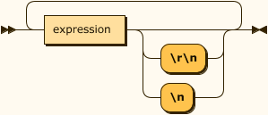
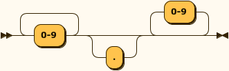
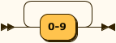
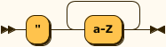

# LOGO Parser :turtle: - Coding Challenge (#[121.1](https://youtu.be/i-k04yzfMpw) & #[121.2](https://youtu.be/aOqEm101fms)) by [The Coding Train](https://thecodingtrain.com/)

## Introduction
The challenge is to write a simple parser (with [P5.js](https://p5js.org/)) for the  [LOGO](https://en.wikipedia.org/wiki/Logo_(programming_language)) programming language.

## :turtle: Requirements
  - A computer connected to internet (It should be fine is you read this....)
  - A simple HTTP server (ex: `python3 -m server.http`)

## :turtle: How to run it ?
Download the repo. files and simply run your http server in the same folder.

## :turtle: Useful Links
  - [Wikipedia](https://en.wikipedia.org/wiki/Logo_(programming_language))
  - [P5.js reference](https://p5js.org/reference/)
  - [Logo tutorial](http://cs.brown.edu/courses/bridge/1997/Resources/LogoTutorial.html)
  - [Logo foundation](https://el.media.mit.edu/logo-foundation/)

## :turtle: Language
Here you can find all the supported LOGO lang features by this parser.

### :turtle: Commands
| Command  | Arguments                                         | Description                                                              |  Available ?   |
| :------- | :------------------------------------------------ | :----------------------------------------------------------------------- | :------------: |
| `fd`     | **distance**                                      | Move the turtle foward by `distance` pixel                               | :green_heart:  |
| `bk`     | **distance**                                      | Move the turtle backward by `distance` pixel                             | :green_heart:  |
| `rt`     | **angle**                                         | Turn the turtle to the right by `angle` degrees                          | :green_heart:  |
| `lt`     | **angle**                                         | Turn the turtle to the left by `angle` degrees                           | :green_heart:  |
| `cs`     |                                                   | Clear the screen                                                         | :green_heart:  |
| `pu`     |                                                   | Hold the pen up (no drawing)                                             | :green_heart:  |
| `pd`     |                                                   | Hold the pen down (drawing)                                              | :green_heart:  |
| `ht`     |                                                   | Not showing the turtle                                                   | :green_heart:  |
| `st`     |                                                   | Show the turtle                                                          | :green_heart:  |
| `home`   |                                                   | Go back to the start position (and rotation)                             | :green_heart:  |
| `label`  | **"** _word_  \|  **[** _string_ **]**            | Write the text between double quote `"..."` at the turtle position       | :green_heart:  |
| `setxy`  | **xpos** **ypos**                                 | Go to the position defined by `xpos` for X axis and `ypos` for Y axis*   | :green_heart:  |
| `repeat` | **nb** **[** _expression_ **]**                   | Execute `nb` times the expression between brackets `[ ... ]`             | :green_heart:  |
| `make`   | **"**__name__ **value**                           | Create variable (named `name`) with the value `value`                    | :green_heart:  |
| `print`  | **value**                                         | Print a `value` in the compilation console                               | :broken_heart: |
| `if`     | **:**_condition_ **[** _expression_ **]**         | Execute the expression between brackets `[ ... ]` if `condition` is true | :broken_heart: |
| `to`     | **name** **:**_parameters_ __expression__ **end** | Create a callable procedure named `name` with parameters                 | :broken_heart: |

\* The (0, 0) point is the home position (it should be the center of the screen), the rotation will be the same. 

### :turtle: Arithmetic functions

| Function | Arguments       | Description                                |  Available ?   |
| :------- | :-------------- | :----------------------------------------- | :------------: |
| `random` | **max**         | Get a random number between 0 and `max`    | :broken_heart: |
| `cos`    | **value**       | Get the cosinus of `value`                 | :broken_heart: |
| `sin`    | **value**       | Get the sinus of `value`                   | :broken_heart: |
| `tan`    | **value**       | Get the tangent of `value`                 | :broken_heart: |
| `arccos` | **value**       | Get the arc cosinus of `value`             | :broken_heart: |
| `arcsin` | **value**       | Get the arc sinus of `value`               | :broken_heart: |
| `arctan` | **value**       | Get the arc tangent of `value`             | :broken_heart: |
| `sqrt`   | **value**       | Get the square root of `vaue`              | :broken_heart: |
| `ln`     | **value**       | Get the natural logarithm of `value`       | :broken_heart: |
| `power`  | **value** **p** | Get the result of `value` to the `p` power | :broken_heart: |

### :turtle: Other

| Feature    | Description                                                   |  Available ?   |
| :--------- | :------------------------------------------------------------ | :------------: |
| Arithmetic | Support arithmetic operations (`+`, `-`, `/`, `*` )           | :broken_heart: |
| Boolean    | Support boolean operations (`>`, `<`, `>=`, `<=`, `==`, `!=`) | :broken_heart: |
| Comments   | Everything beetween `;` and the end of the line is not parsed | :green_heart:  |

## Syntax Diagram
### language

### expression

### distance

### angle

### value

### numeric_value

### math_function

### operator

### text_variable

### numeric_variable

### number

### integer

### word

### string

